# Ventri 设计与路线图

> **状态**：定稿 v1.0（路线定义文档） · **日期**：2026-10-08 · **作者**：Jeff（Grok Bot 协助起草）
>
> **适用范围**：Ventri Core（内核）、ventri-std（标准插件）、Ventri Agent（DeepSeek 优先的个人 Agent）
>
> **约定**：本文中的“**决定**”是已拍板的路线；“**目标**”是需要基准测试验证的数字；“**估算**”是工期估计，不是承诺。每张图在文中以 Mermaid 源码给出，并附同名 PNG（`docs/img/`，由 `docs/build/build.py` 渲染）。
>
> **修订**：2026-10-08 v1.1 —— 记录 Jeff 对第 10 节待决问题的答复（许可证、投入、数据策略、平台、T2 网络权限），新增 6.1 Harness 生态兼容，更新 PyPI 占位状态。v1.2 —— 其余问题全部拍板：名称 Ventri Agent / `va`、不建 GitHub 组织、IM 只做飞书、web 搜索推迟、内核只支持 asyncio。

---

## 1 愿景与定位

### 1.1 一句话

**Ventri 是一个 Python 的 Agent 运行时内核：插件即生命周期作用域、变更即事务、模型产出默认不受信任；Ventri Agent 是构建在它之上的、DeepSeek 优先的个人 Agent。** 两者同时发布，由 Agent 带动内核的采用。

名称取自拉丁语 *ventriculus*（心室）。cordis 意为“心脏”，Ventri 是那个把血液泵向全身的“心室”——驱动插件的加载、运行与更替。

### 1.2 它是什么 / 不是什么

| 它是 | 它不是 |
|---|---|
| 一个**长期运行进程**的运行时内核：插件树 = 任务树 = 作用域树，任何变更都可原子提交、精确回滚、可观测 | 不是 “Python 版 cordis”：**不追求** cordis API 兼容，不运行 JS 插件，不兼容 `cordis.yml` |
| 一个**可自我观察、可受控自我演化**的个人 Agent：它能看到自己的插件树，能提出新插件/配置变更，经沙箱试运行与用户批准后事务化生效，一键回滚 | 不是 LLM 编排库（LangGraph/PydanticAI 这类可以作为 Ventri 插件被托管） |
| **DeepSeek 优先**：深度利用思考模式、上下文硬盘缓存、峰谷定价、strict 工具调用 | 不是 DeepSeek 绑定：Provider 接口支持任意 OpenAI 兼容端点 |
| **本地优先、单用户、单机**：数据在 `~/.ventri/`，格式为 YAML / JSONL / SQLite / Markdown；**1.0 只支持 macOS** | 不是多租户 SaaS、不是分布式运行时、不是工作流引擎（Temporal/Airflow） |
| 有**安全边界**：模型生成的插件只在子进程沙箱中运行，按能力清单访问服务 | 不提供“进程内安全 exec”——Python 进程内没有可信的隔离，我们不假装有 |

### 1.3 目标用户（按优先级）

1. **P1 — 开发者型个人用户（含 Jeff 本人）**：愿意写 YAML、装插件、看日志；要一个可 hack、自托管、成本低、中文友好、能接飞书的个人 Agent。**这是 1.0 之前唯一的验收用户群。**
2. **P2 — 构建长期运行 Agent 服务的 Python 开发者**：需要插件热插拔、配置热更新、会话级资源回收、可回滚变更。他们是内核（`ventri`）的用户，通过 Agent 的口碑被吸引而来。
3. **非目标用户**：不写配置的普通消费者（1.0 前不做安装器/桌面 App）、企业多租户部署。

### 1.4 完成态（1.0）的产品形态

1.0 发布时，下面这段体验必须全部真实可用：

```text
$ pipx install ventri-agent
$ va init                       # 生成 ~/.ventri/ventri.yml，写入 DeepSeek key（存 macOS 钥匙串）
$ va chat                       # CLI 对话：流式输出、思考过程折叠、工具调用前弹出审批
> 帮我把 ~/notes/周报 里本周的内容整理成提纲，发到飞书
  [审批] tools.fs.read ~/notes/周报/*  (只读)   → 本会话允许
  [审批] channels.feishu.send → 群「周报」        → 允许一次
$ va serve                      # 守护进程：本地 Web UI (127.0.0.1:7788) + 飞书机器人 + 定时任务
$ va tree                       # 实时插件树：状态、服务、任务数、会话作用域、成本
$ va propose list               # Agent 提出的演化提案（新插件/配置补丁），附试运行报告
$ va propose approve 17         # 批准 → 单事务提交
$ va history && va rollback 17  # 演化账本；一键回滚 = 反向事务，快照逐字段恢复
```

- **每天早上 08:00（北京时间，DeepSeek 谷时）** 例行任务读取日历与订阅源，生成简报推送到飞书；可延后任务自动排进谷时以半价执行。
- 修改 `ventri.yml` 保存即生效：加载器计算差异，**作为一个事务**应用；失败则旧配置继续运行，并报告是哪个插件、为什么失败。
- 任何对外部世界有后果的动作（写文件、执行命令、发消息、花钱）都经过权限引擎；“本会话允许”的授权随会话作用域回收而自动撤销。
- Agent 能用 `inspect` 工具读取自己的插件树与 trace（脱敏），据此诊断“为什么 MCP 工具不见了”。

---

## 2 设计原则

1. **一切皆插件，内核极小。** 内核只依赖 `anyio`；模型、工具、记忆、渠道、配置加载器本身都是插件。**目标**：内核 ≤ 3000 行有效代码。
2. **生命周期即作用域（结构化并发）。** 插件树 = 任务树；插件卸载时，它的任务、监听器、服务、子插件按确定顺序全部回收。没有“孤儿任务”。
3. **变更即事务。** 加载/卸载/替换/重配置可以批量原子提交；失败则精确回滚到事务前快照。声明式配置的每次应用都是一个事务。
4. **类型优先。** `ctx.get(Type) -> Type` 是一等 API；依赖从函数签名推断；`ctx.llm` 这类属性访问通过生成的 stub 获得类型。
5. **可观测即接口。** 插件树、快照、trace 是稳定的公开数据结构（有 schema 版本），人、工具、Agent 自己都能读取。
6. **默认不信任模型产出。** 模型生成的代码只在子进程沙箱中运行，按能力清单最小授权；有后果的动作必须经人批准；Agent 永远不能批准自己的提案。
7. **DeepSeek 优先，而非 DeepSeek 绑定。** 默认配置、提示布局、成本策略为 DeepSeek 优化；能力通过 Provider 能力描述符协商，换模型不改上层代码。
8. **诚实的保证。** 每个机制都写明“保证什么 / 不保证什么”，并有对应测试。宁可少承诺，也不给出无法兑现的“热重载”“沙箱”字样。
9. **本地优先，数据归用户。** 所有状态是普通文件，可 `git` 版本化、可手工编辑、可迁移。

---

## 3 总体架构

### 3.1 全景图

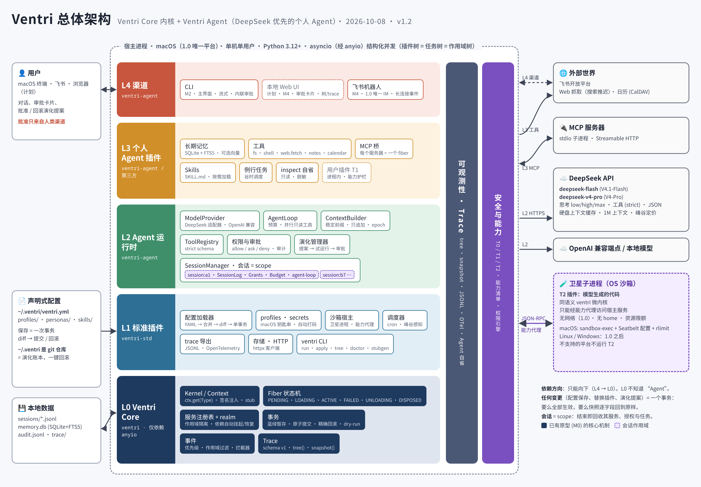

全景图从下到上是五层，外加两条横切关注点（可观测性、安全/能力）和一个进程边界（沙箱卫星进程）。1.0 的运行平台只有 macOS（见 10.1 D5）：

| 层 | 发行包 | 内容 | 依赖 |
|---|---|---|---|
| **L0 Ventri Core** | `ventri` | Kernel、Context、Fiber 状态机、服务注册表与作用域、事务、事件、trace | 仅 `anyio` |
| **L1 标准插件** | `ventri-std` | 声明式配置加载器/监视器、profiles、secrets、日志、JSONL/OTel 导出、HTTP 客户端、存储、调度器、沙箱宿主、`inspect`、`ventri` CLI | `ventri` + 可选 extras |
| **L2 Agent 运行时** | `ventri-agent` | ModelProvider 接口与 DeepSeek/OpenAI 兼容适配器、AgentLoop、ToolRegistry、SessionManager、ContextBuilder、权限与审批、记忆接口、演化管理器 | `ventri`, `ventri-std`, `httpx`, `pydantic` |
| **L3 个人 Agent 插件** | `ventri-agent`（内置）/ 第三方 | 记忆实现、文件/Shell/Web/日历/笔记工具、MCP 桥、Skills、例行任务 | L2 |
| **L4 渠道** | `ventri-agent`（内置）/ 第三方 | CLI → 本地 Web UI（计划）→ 飞书（1.0 唯一 IM） | L2 |

### 3.2 依赖分层（源码依赖方向）

<!-- fig: layers -->
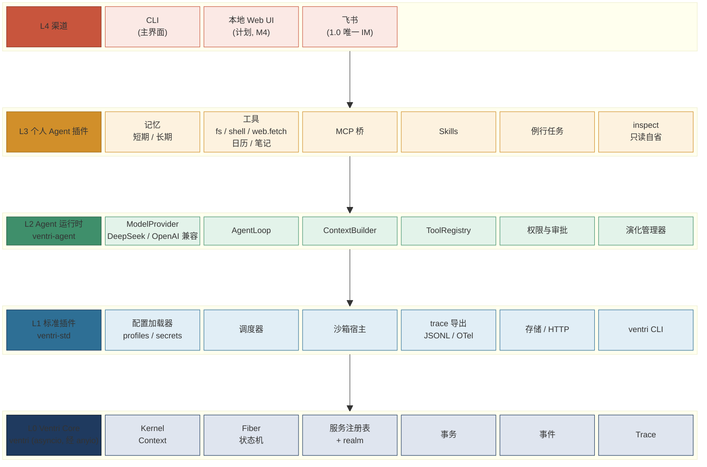

*图：依赖分层（PNG：[img/layers.png](img/layers.png)）*

**决定**：依赖只能向下。L0 不知道“Agent”的存在；L2 不知道具体渠道；渠道只通过 `ChannelMessage` / `ApprovalRequest` 事件与运行时交互。

### 3.3 运行时插件树（一个典型进程）

<!-- fig: fiber-tree -->
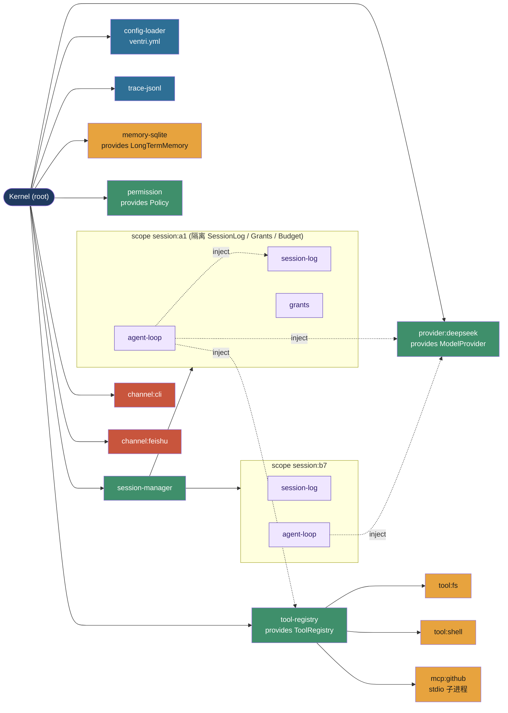

*图：运行时插件树（PNG：[img/fiber-tree.png](img/fiber-tree.png)）*

实线是父子关系（同时是任务树与回收顺序），虚线是服务依赖。会话是作用域（scope）：`session:a1` 结束时，其下的日志写入器、授权、Agent 循环及其所有任务被确定性回收；`mcp:github` 子进程崩溃只会让它自己 `FAILED`，依赖它的工具自动下线，其它一切照常。

---

## 4 内核设计（Ventri Core）

### 4.1 核心概念

| 概念 | 定义 | 原型状态（M0） |
|---|---|---|
| **Kernel** | 根 Context；持有根 task group、服务注册表、事务锁、trace 环形缓冲 | ✅ |
| **Fiber** | 一个插件实例的生命周期载体：状态机、per-fiber 锁、task group、LIFO effect 栈 | ✅ |
| **Context** | 插件看到的 API；每个 Fiber 一个；`ctx.parent` 向上 | ✅ |
| **Plugin** | `fn(ctx, config)`（可 async）或类 `Cls(ctx, config)`（可选 `start/stop`）；元数据 `name / inject / Config` | ✅ |
| **Service** | 按类型（或字符串）键注册的值；生命周期 = 提供者 Fiber | ✅（全局） |
| **Scope / Realm** | 隔离一组服务键的子树；会话就是 scope | ⏳ M1 |
| **Effect** | 注册即执行、卸载时逆序清理的副作用（监听器、服务、任务、`enter` 的上下文管理器） | ✅ |
| **Transaction** | 蓝绿暂存 + 同步原子提交 + 精确回滚 | ✅（命令式）；声明式 ⏳ M1 |
| **Trace** | 结构化事件流；`tree()` / `snapshot()` | ✅；schema v1 与导出 ⏳ M1 |

### 4.2 API 速写

M0 已有 API 保持不变；M1 新增**从签名推断依赖**与**可选依赖**（`X | None` 不阻塞激活）。

```python
from ventri import Context, plugin, Secret
from pydantic import BaseModel

class DeepSeekConfig(BaseModel):
    api_key: Secret[str]                 # trace / tree() 中自动打码
    base_url: str = "https://api.deepseek.com"
    model: str = "deepseek-flash"

@plugin(provides={"llm": ModelProvider})          # provides 用于 stub 生成与静态诊断
async def deepseek(ctx: Context, cfg: DeepSeekConfig) -> None:
    http = await ctx.enter(httpx.AsyncClient(base_url=cfg.base_url, timeout=60))
    ctx.provide(ModelProvider, DeepSeekProvider(http, cfg), name="llm")

@plugin(timeout=10)                                # M1：加载超时，超时即 FAILED(LoadTimeout)
async def daily_brief(ctx: Context, cfg: BriefConfig,
                      llm: ModelProvider,           # 签名推断 inject=[ModelProvider]
                      cal: Calendar | None):        # 可选依赖：缺失也能激活
    ctx.spawn(run_forever, llm, cal)                # 卸载时取消并等待结束
    ctx.on(MessageIn, on_message, priority=10)      # 类型化事件 + 优先级（M1）

async with Kernel() as app:
    fiber = await app.plugin(daily_brief, {"hour": 8})  # 缺 ModelProvider → PENDING
    async with app.transaction() as tx:                 # 原子：要么都生效，要么都不
        await tx.plugin(deepseek, {"api_key": "..."})
        await tx.replace(other_fiber, config={...})
    print(app.tree())
```

**类型化服务访问（决定）**：

- 一等 API 是 `ctx.get(Type) -> Type`，永远有类型；签名注入的参数天然有类型。
- `ctx.llm` 属性语法糖由 `ventri stubgen` 生成：扫描 `ventri.plugins` entry point 的 `provides` 声明，生成 `ventri_stubs.pyi`，内含 `class Ctx(Context): llm: ModelProvider; memory: LongTermMemory; ...`。插件把参数标注为 `ctx: Ctx` 即获得补全与 mypy/pyright 检查。运行时行为不变。
- 字符串键保留（兼容动态场景），但 lint 规则提示改用类型键。

### 4.3 Fiber 生命周期状态机

<!-- fig: fiber-state -->
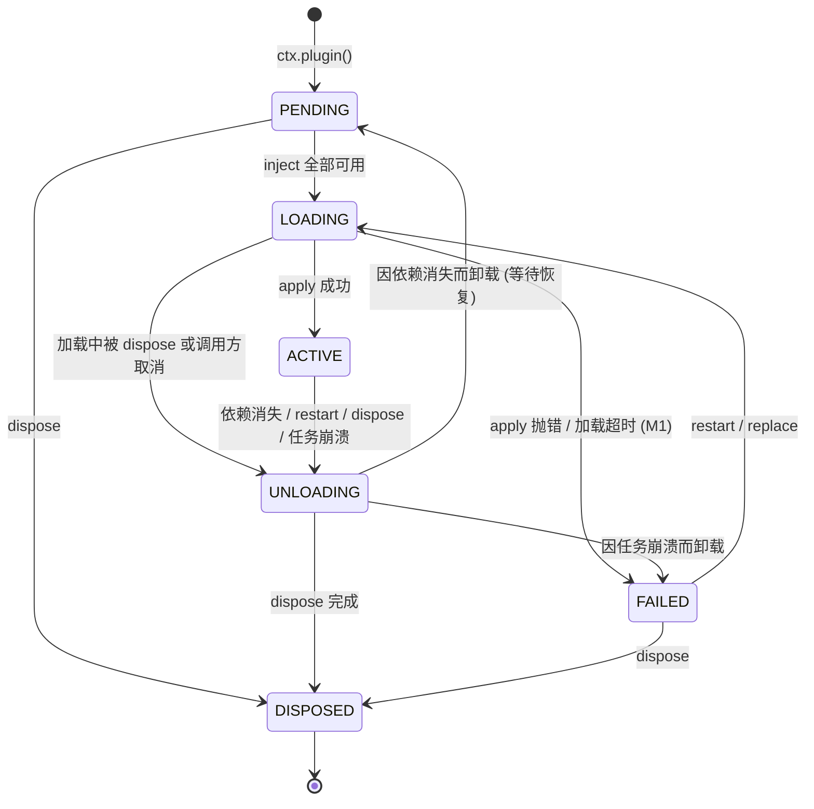

*图：Fiber 生命周期状态机（PNG：[img/fiber-state.png](img/fiber-state.png)）*

规则（已由 M0 测试覆盖）：

- **依赖方先拆、服务后删**：移除服务前先卸载依赖它的插件，依赖方的清理代码仍能使用该服务。
- **per-fiber 一致视图**：已 inject 的键在 fiber 重启前始终返回激活时绑定的实例。
- **确定的拆除顺序**：子 fiber（新→旧，递归）→ 本 fiber 的 effect（LIFO）→ 关闭 task group 兜底；拆除被 shield，清理异常只进 trace。
- **M1 新增**：`FAILED` 可配置重试策略 `retry: {max: 3, backoff: exp}`（默认不重试）；依赖环检测（见 4.9）。

### 4.4 结构化并发模型

- **任务归属 = 插件树**。`ctx.spawn` 的任务各有独立 `CancelScope`，并作为“取消并等待”的 effect 压入所属 fiber 的栈，卸载时与其他 effect 按 LIFO 交错执行。*（M1 实施说明：M0 中每个 fiber 还在父 fiber 的 task group 里启动一个宿主任务、内开自己的 task group 作兜底；由于任务本来就由 effect 拥有，M1 去掉了宿主任务，任务直接在 Kernel 的 task group 中运行——每个空 fiber 约省 6 KB，才达到 4.13 的 8 KB 目标；归属、拆除顺序与异常归属语义不变。）*
- **异常归属（supervisor 语义）**：spawn 任务抛异常 → 所属 fiber 被拆除并置 `FAILED`；兄弟与 Kernel 不受影响。
- **重入安全**：每个 fiber 一把锁并记录持锁任务；加载中被 dispose、自我 dispose、在自己 spawn 的任务里 dispose 自己，均不死锁、不泄漏。
- **取消即不泄漏**：调用 `await ctx.plugin(...)` 的任务被取消，正在加载的 fiber 被完整拆除。
- **后端（决定）**：**只支持 asyncio**（内核与 Agent 一致），不再支持 trio。实现上内核继续以 `anyio` 作为内部依赖、固定运行在 asyncio 后端上——这是最简单的做法：`anyio` 的 task group、可 shield 的 `CancelScope` 与 `fail_after` 正是内核的结构化并发与“拆除不被打断”所依赖的原语，标准库 `asyncio.TaskGroup` 没有等价的嵌套取消作用域，改写为纯 asyncio 收益小、风险大。`anyio` 不出现在公开 API 中，插件可直接使用 asyncio 生态（MCP SDK、httpx、飞书 SDK）。原型的测试已改为只在 asyncio 上运行。

### 4.5 事务语义

#### 4.5.1 流程

<!-- fig: tx-seq -->
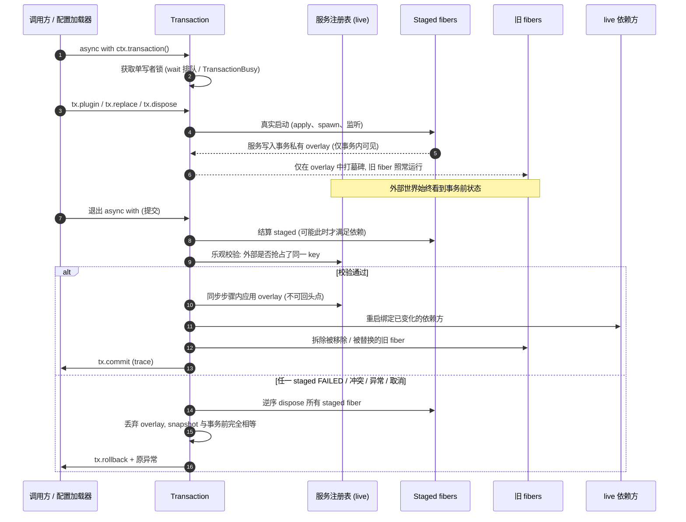

*图：事务流程（PNG：[img/tx-seq.png](img/tx-seq.png)）*

#### 4.5.2 保证（M0 已实现并测试）

| # | 保证 |
|---|---|
| G1 原子性 | live 注册表只在一个同步步骤（无 `await`）内切换；任何观察者只能看到全部或全无 |
| G2 隔离性 | 提交前 staged 服务对 live fiber 不可见；staged 监听器听不到外部事件；被移除/替换的 fiber 照常运行 |
| G3 精确回滚 | apply 抛错、块内代码抛错、事务被取消、提交前校验失败 → 回滚后 `snapshot()` 与事务前**逐字段相等** |
| G4 串行化 | 每个 Kernel 同时只有一个事务；`wait=True` FIFO 排队，`wait=False` 立即 `TransactionBusy`；嵌套报错（M1 起细化为按 scope 加锁，见 4.5.4 与 4.6） |
| G5 冲突检测 | 事务期间的非事务操作若与 overlay 冲突，提交时检出并回滚 |

#### 4.5.3 不保证（写入文档与 API docstring）

- **N1** staged 插件对外部世界的副作用（网络请求、写文件、发消息）**不会被撤销**，只会执行其清理 effect。→ 对策：试运行模式下，Agent 层把 staged 插件的有后果工具调用路由到“演练模式”（见 5.9）。
- **N2** 不可回头点之后的失败（依赖方重启失败、旧 fiber 清理抛错）不回滚，表现为 `FAILED` fiber + trace 事件。
- **N3** 蓝绿模式要求新旧实例短暂共存；独占资源（端口、文件锁、单例 IM 长连接）须用 **stop-first**。
- **N4** live 依赖方在交换后会短暂重启，期间不服务，但**不会观察到服务缺失**。

#### 4.5.4 M1 扩展（决定）

| 扩展 | 语义 |
|---|---|
| **stop-first 替换** | `tx.replace(f, strategy="stop-first")` 或插件元数据 `exclusive=True`。提交时先停旧、再启新；若新实例失败，以原 config 重启旧实例。**保证降级**：回滚恢复配置与服务拓扑，但旧实例内存状态丢失；trace 标记 `tx.rollback.degraded` |
| **dry-run** | `ctx.transaction(dry_run=True)`：完整暂存并结算，执行用户提供的探针（probe）后**总是回滚**，返回 `TxReport`（新增/移除/重启的 fiber、服务差异、失败原因、探针结果）。自我演化的试运行基础 |
| **事务元数据** | `ctx.transaction(origin="config" / "user" / "evolution:17", reason="...")`，进入 trace 与演化账本 |
| **超时** | `ctx.transaction(timeout=30)`；超时等同取消 → 回滚 |
| **作用域感知** | overlay 的键变为 `(realm, key)`；会话内事务只锁该会话 realm（细化 G4 的锁粒度，见 4.6） |

### 4.6 作用域与隔离（M1 新增，原型缺口）

**问题**：M0 的服务是 Kernel 全局的；两个会话无法各自拥有 `SessionLog`，会话结束也无法“整体回收”其服务。

**设计（决定）**：引入 **realm**（服务命名空间）。

```python
session = await sessions_ctx.scope("session:a1", isolate={SessionLog, Grants, Budget})
await session.ctx.plugin(session_log, {"path": "~/.ventri/sessions/a1.jsonl"})
await session.ctx.plugin(agent_loop)          # 拿到的是 session:a1 的 SessionLog
...
await session.dispose()                       # 整个会话（服务、授权、任务）确定性回收
```

- `ctx.scope(name, isolate=keys)` 创建一个 scope fiber，它是 `keys` 的 realm 边界。
- **解析规则**：对键 K，从当前 fiber 向上找第一个隔离了 K 的祖先 scope，在其 realm 中查找/注册；找不到则用根 realm。`provide` 与 `get` 使用同一规则，因此会话内 `provide(SessionLog)` 只进入该会话 realm，而 `provide(ModelProvider)` 仍是全局。
- **可见性**：兄弟 scope 互不可见；scope 内可读取祖先 realm 中未隔离的键。
- **reconcile 与事务**：按 realm 分桶；会话 realm 内的变更只触发该子树 reconcile。事务锁细化为“根 realm 锁 + 每 scope 锁”：会话内事务互不阻塞，根 realm 事务与所有会话事务互斥。
- **事件**：见 4.8，事件按 scope 冒泡，不跨兄弟 scope。
- **快照**：`snapshot()` 增加 `realms` 段；回滚断言覆盖 realm。
- **不做**：cordis 式的属性代理 mixin（`ctx.foo` 委托到服务方法）。理由：破坏类型推断，与原则 4 冲突。

### 4.7 声明式配置与加载器（ventri-std）

```yaml
# ~/.ventri/ventri.yml
version: 1
profiles: [home]                       # 叠加 profiles/home.yml 的补丁
plugins:
  - use: ventri_std.trace.jsonl
    config: { path: ~/.ventri/trace/, rotate_mb: 64 }
  - use: ventri_agent.providers.deepseek
    id: ds
    config:
      api_key: ${secret:deepseek}      # macOS 钥匙串；也支持 ${env:DEEPSEEK_API_KEY}
      routes:
        default: { model: deepseek-flash,  thinking: true,  effort: high }
        plan:    { model: deepseek-v4-pro, thinking: true,  effort: max  }
        cheap:   { model: deepseek-flash,  thinking: false }
  - use: ventri_agent.memory.sqlite
    config: { path: ~/.ventri/memory.db }
  - group: tools                       # group = 不提供服务的容器 fiber，便于整体禁用
    plugins:
      - use: ventri_agent.tools.fs
        config: { roots: [~/notes, ~/projects], write: ask }
      - use: ventri_agent.tools.shell
        config: { policy: ask, cwd: ~/sandbox }
      - use: ventri_agent.mcp
        id: github
        config: { command: [github-mcp-server, stdio], risk: ask }
  - use: ventri_agent.channels.cli
agents:                                # Agent 预设：人格 + 工具子集 + 模型路由
  default: { persona: personas/jeff.md, tools: ["*"], route: default }
  coder:   { persona: personas/coder.md, tools: [fs, shell, github.*], route: plan }
```

```yaml
# ~/.ventri/profiles/work.yml —— profile 是有序补丁，按 id 定位
patch:
  - { id: ds, config: { routes: { default: { model: deepseek-v4-pro } } } }
  - { id: github, disabled: true }
  - add: { use: ventri_agent.channels.feishu, id: feishu-work, config: { app: work } }
```

**加载流程**：

<!-- fig: config-apply -->
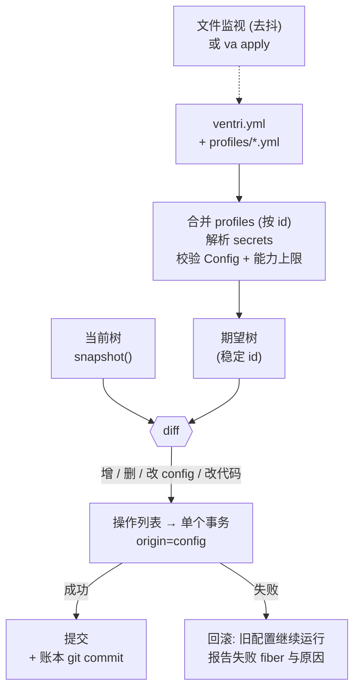

*图：声明式配置加载流程（PNG：[img/config-apply.png](img/config-apply.png)）*

规则（决定）：

- **稳定 id**：显式 `id`，否则为 `use` + 在父节点中的序号。diff 以 id 为准；`use` 变化视为替换。
- **config 等价比较**基于校验后的模型（而非 YAML 文本），格式变化不触发重启。
- **一次保存 = 一个事务**；文件监视去抖 300 ms；`va apply --dry-run` 打印 `TxReport` 不生效。
- **secrets 永不进入快照/trace/账本**；`Secret[T]` 类型 + 键名模式（`*key*`、`*token*`、`*secret*`、`*password*`）双重打码。
- 配置目录 `~/.ventri/` 默认是一个 git 仓库，加载器每次成功提交后自动 commit（演化账本的载体，见 5.9）。

### 4.8 事件系统

- **事件键类型化**：`MessageIn = Event[ChannelMessage]("message.in")`；`ctx.on(MessageIn, handler)` 的 handler 参数有类型。字符串事件名保留。
- **四种分发模式**保留：`emit`（顺序、错误隔离）、`parallel`（并发、错误隔离）、`serial`（顺序、返回首个非 None、错误上抛）、`bail`（同步版 serial）。
- **M1 新增**：`priority: int`（高者先，默认 0，同优先级按注册序）；**作用域过滤**：在 scope S 内发出的事件，投递给 S 子树内及祖先上的监听器，不投递给兄弟 scope（会话之间天然隔离）。
- **拦截器**：`ctx.intercept(ToolCall, fn)` 是 `serial` 的语法糖，返回 `Deny(reason)` / `Rewrite(new)` / `None`（放行）。权限引擎、审计、演练模式都实现为拦截器。
- **决定：emit 保持 async**（与 cordis 的同步 emit 不同）。理由：监听器常需 await（写日志、审批）；同步快路径仅保留 `bail`。不提供跨进程事件总线（卫星进程通过 RPC 代理订阅）。

### 4.9 依赖诊断与加载超时（M1）

- **依赖环**：每轮 reconcile 后，对 `PENDING` fiber 的“等待键 → 可提供该键的 fiber（含 PENDING）”图做 Tarjan SCC；环上的 fiber 标记 `pending_reason="cycle: A → B → A"`，发 `dep.cycle` trace；`strict=True` 的事务直接失败。
- **缺失提供者**：`pending_reason="missing: ModelProvider (no plugin provides it)"`，`tree()` 与 `va doctor` 显示。
- **加载超时**：插件元数据 `timeout`（默认 30 s，配置可覆盖，`None` 关闭）；超时取消 apply → 清理 → `FAILED(LoadTimeout)`。

### 4.10 可观测性

- **Trace schema v1（M1 冻结）**：`{v:1, seq, ts, kind, fiber: "root/tools/mcp:github", scope, tx, attrs}`；`kind` 枚举：`fiber.state`、`service.bind/unbind`、`task.spawn/error`、`effect.error`、`event.error`、`tx.begin/commit/rollback`、`dep.cycle`，Agent 层追加 `agent.turn`、`model.call`、`tool.call`、`approval.*`、`evolution.*`。
- **Sink**：内存环形缓冲（内核）、JSONL 轮转文件、OpenTelemetry（spans：`fiber.load`、`tx`、`agent.turn`、`model.call` 采用 OTel GenAI 语义约定属性、`tool.call`；metrics：各状态 fiber 数、事务提交/回滚数、缓存命中率、成本）。
- **自我可见**：`inspect` 服务向 Agent 提供只读、脱敏的 `tree()` / `snapshot()` / 最近 N 条 trace 查询。这是 Harness `dsh-tool-cordis` 最终收敛到的形态（只读 inspect），我们**从一开始就只给只读**；写操作只能走演化提案。

### 4.11 沙箱与能力模型

**信任分级（决定）**：

| 级别 | 来源 | 运行位置 | 约束 |
|---|---|---|---|
| **T0 可信** | 内核、ventri-std、ventri-agent 内置插件、用户 pip 安装并在配置中启用的包 | 进程内 | 无（用户已决定信任） |
| **T1 本地** | 用户自己写的 `~/.ventri/plugins/*.py` | 进程内 | 必须声明能力清单；越权访问在**开发模式**告警、**正常模式**拒绝（进程内只是“护栏”，不是安全边界） |
| **T2 不可信** | **模型生成**或来源未知的插件代码 | **卫星子进程 + macOS 沙箱（Seatbelt）** | 只能通过能力代理访问宿主服务；**无网络**（1.0 范围内不开放，见下）、无 home 目录、资源受限 |

**能力清单**（随插件提交，演化提案必须携带）：

```yaml
# capability manifest
name: weekly-review
tier: T2
services:
  ToolRegistry: [register]           # 只能注册工具，不能调用他人工具
  LongTermMemory: [search]           # 只读
events: { emit: [], on: [routine.tick] }
net: []                              # 1.0：T2 一律无网络；字段保留，语义待定
fs: { read: [], write: ["$PLUGIN_DATA"] }
limits: { cpu_s: 30, mem_mb: 256, wall_s: 120 }
```

<!-- fig: sandbox -->
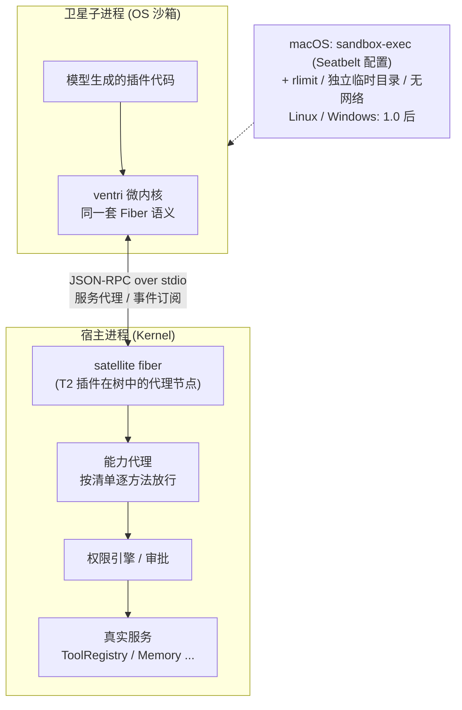

*图：沙箱与能力代理（PNG：[img/sandbox.png](img/sandbox.png)）*

- **决定**：T2 的唯一边界是**进程 + OS 沙箱**；Python 进程内的 restricted exec / AST 白名单**不被视为安全机制**（Harness 早期 `cordis_mount` 在非隔离 VM 中允许模型写插件，后收敛为只读 inspect，是前车之鉴）。
- 卫星进程内运行同一套 ventri 微内核，因此插件写法与 T0 相同，迁移只改清单。
- 服务调用经代理序列化（JSON），只支持“方法调用 + 事件”形态的服务接口；需要传递 Python 对象的服务不能暴露给 T2。
- 卫星崩溃/超限 → 宿主侧 satellite fiber `FAILED`，与普通插件崩溃语义一致。
- **平台（决定）**：1.0 **只支持 macOS**。T2 沙箱后端 = `sandbox-exec` + 按插件生成的 Seatbelt 配置（默认拒绝；只放行插件数据目录与 RPC 管道），配合 `setrlimit`、独立临时目录与清空的环境变量；若 M3 评估发现更合适的 macOS 原生机制，可替换后端，接口不变。Linux（bubblewrap/seccomp/landlock）与 Windows 推迟到 1.0 之后；在不支持的平台上**不降级运行 T2**。
- **已知约束**：`sandbox-exec` 被 Apple 标记为弃用，但目前仍可用（见 R13）；沙箱后端藏在 `SandboxBackend` 接口之后，便于替换。
- **T2 网络权限（推迟决策）**：1.0 范围内 T2 插件**完全没有网络访问**；清单中的 `net` 字段保留但必须为空。是否以及如何开放（域名白名单、首用审批等）留待 1.0 之后决定。需要联网的能力只能由 T0/T1 插件或 MCP 服务器提供，并经权限引擎。

### 4.12 热重载策略与极限

| 变更类型 | 机制 | 保证 |
|---|---|---|
| **配置变化** | `replace(config=...)` 事务 | 完整 G1–G5（主路径，覆盖 90% 的日常变更） |
| **T2 插件代码** | 重启卫星进程（新进程加载新代码），事务化替换 | 真正的代码重载，无泄漏 |
| **T0/T1 插件代码（进程内）** | 仅开发模式：`importlib.reload` 插件模块 + `replace(plugin=new)` | **不保证**：类身份变化、模块全局、C 扩展、被他人持有的旧对象引用都会泄漏；检测到旧类实例仍被引用时告警 |
| **内核 / 依赖库升级** | 进程重启；会话从 JSONL 日志恢复，例行任务从调度表恢复 | 会话可续，内存状态不保留 |

**决定**：文档与 CLI 中不使用“无缝热重载”字样；`va reload` 对进程内代码打印上述限制。

### 4.13 性能目标（M1 用基准测试验证）

| 指标 | 目标 |
|---|---|
| `ctx.get(Type)`（3 层 scope） | p50 ≤ 2 µs |
| 激活 500 个空插件（单事务） | ≤ 150 ms |
| 500 插件树上单 key 替换事务的内核开销（不含插件 apply） | ≤ 20 ms |
| 创建 + 回收一个会话 scope（含 3 个空插件） | ≤ 5 ms |
| `emit` 到 100 个同步监听器 | ≤ 1 ms |
| 每个空 Fiber 内存 | ≤ 8 KB |
| Agent 运行时在首 token 前追加的延迟（不含网络） | ≤ 20 ms |

规模假设：数百个插件、数十个并发会话。超过数千插件不是目标。

---

## 5 Agent 设计（Ventri Agent）

### 5.1 Agent 循环即插件

`agent-loop` 是一个普通插件，部署在每个会话 scope 内，依赖 `ModelProvider`、`ToolRegistry`、`SessionLog`、`ContextBuilder`、`Policy`，可选依赖 `LongTermMemory`。替换 Agent 策略（如换成计划-执行式循环）就是一次 `replace`。

<!-- fig: agent-turn -->
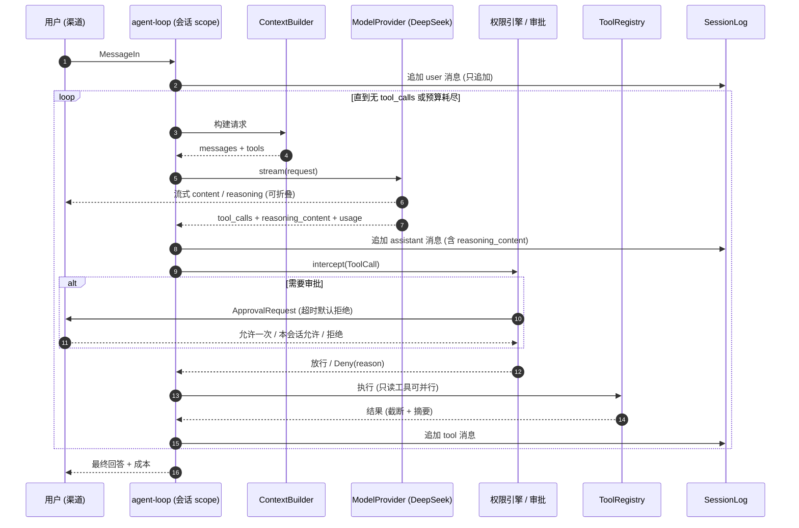

*图：Agent 单轮执行时序（PNG：[img/agent-turn.png](img/agent-turn.png)）*

请求布局遵循 5.3 节：稳定前缀 + 只追加历史 + 尾部动态块，工具集在一个 epoch 内冻结；每轮结束向渠道报告成本与缓存命中率。

**预算**（每会话 `Budget` 服务，会话 realm 隔离）：最大步数（默认 40）、最大工具调用、最大 token、最大费用（默认每轮 ¥2 等值）、墙钟时间。耗尽即以“已完成部分 + 下一步建议”结束本轮。

### 5.2 DeepSeek 适配器

**核验于 2026-10-08 的 DeepSeek API 现状**[^ds-pricing][^ds-changelog]：

| 项 | 现状 | 适配器策略 |
|---|---|---|
| 模型 | `deepseek-flash`（DeepSeek-V4.1-Flash，2026-09-10 发布，原生多模态）与 `deepseek-v4-pro`（V4-Pro-0813）。`deepseek-chat` / `deepseek-reasoner` 已于 2026-07-24 下线；`deepseek-v4-flash` 等旧名暂时路由到 V4.1-Flash | 配置里只写**路由别名**（default/plan/cheap），模型名集中在一处；启动时探测并告警已废弃名称 |
| 上下文 / 输出 | 上下文 1M；最大输出 384K | 能力描述符声明；ContextBuilder 按此规划，但默认软上限 256K 以控成本与延迟 |
| 思考模式 | 默认开启；`thinking: {type: enabled/disabled}` + `reasoning_effort: low/high/max`；思考模式下 `temperature` 等参数无效[^ds-thinking] | 路由级配置；cheap 路由关闭思考 |
| 思考 + 工具 | 带 `tools` 的请求必须**完整回传历次 `reasoning_content`**，否则 400[^ds-thinking] | SessionLog 原样保存 `reasoning_content`；适配器在发送前校验，缺失即本地报错而非等 400 |
| 工具调用 | 支持；`strict` 模式（Beta，`/beta` 端点，schema 须全 required + `additionalProperties:false`，不支持 `minLength` 等）[^ds-tools] | 工具 schema 生成器默认产出 strict 兼容 schema；strict 作为开关 |
| 中途插入工具调用 | Chat Completions **不支持**插入非模型生成的 tool call（支持中途 system 消息）；Anthropic / Responses 格式支持[^ds-tools] | M2 只用 Chat Completions，**不依赖**合成工具调用；检索结果作为尾部 system/user 块注入。Responses 格式适配作为 M3 可选项 |
| JSON 输出 | 支持 | 内部结构化调用（记忆抽取、标题、计划）使用 JSON 输出 + pydantic 校验 + 一次修复重试 |
| 对话前缀续写 / FIM | Beta；FIM 仅非思考模式 | 前缀续写用于强制输出格式；FIM 仅给“笔记补全”工具，低优先级 |
| 视觉 | Flash 支持，Pro 不支持 | 能力描述符 `vision`；带图片的轮次自动路由到 Flash |
| 硬盘缓存 | 默认开启；只有**完全匹配一个已持久化的前缀单元**才命中；单元在“用户输入末尾/模型输出末尾”、检测到公共前缀时、长输入的固定间隔处持久化；尽力而为，数小时至数天清除；`usage.prompt_cache_hit_tokens / miss_tokens` 报告命中[^ds-cache] | 见 5.3 的缓存友好布局；每轮记录命中率 |
| 峰谷定价 | 谷时为峰时半价；峰时 = UTC 01:00–04:00 与 06:00–10:00（周一至周五，中国法定节假日除外）= **北京时间 09:00–12:00、14:00–18:00 工作日**[^ds-pricing] | 成本计量按时段计价；可延后任务（例行任务、记忆整理、批量摘要）调度到谷时 |
| 价格（每 1M token，USD，谷时/峰时） | Flash：缓存命中 0.003/0.006，未命中 0.15/0.30，输出 0.60/1.20；Pro：0.022/0.044，0.66/1.32，1.98/3.96[^ds-pricing] | 价格表作为可更新配置，不硬编码进逻辑 |
| 并发上限 | Flash 2500，Pro 500 | 适配器内全局信号量 + 429 指数退避 |
| 兼容格式 | OpenAI Chat Completions、Responses API、Anthropic 格式 | 主路径 Chat Completions（与“OpenAI 兼容”适配器共用代码） |

**模型路由（决定，默认值）**：日常对话与工具调用 = `deepseek-flash` + 思考 high；显式规划/复杂编码/用户 `/think max` = `deepseek-v4-pro` + max；记忆抽取、标题、摘要、分类 = `deepseek-flash` 非思考 + JSON 输出。路由切换会打断缓存前缀（不同模型不共享缓存），因此**同一会话内不在每轮之间来回切换主模型**；Pro 用于独立的“规划子调用”，其结论以文本注入主会话尾部。

**Provider 接口**：

```python
class ModelProvider(Protocol):
    caps: ModelCaps            # context, max_output, thinking, effort_levels, tools, strict,
                               # json, fim, vision, cache: "prefix-disk" | "none" | ...
    async def stream(self, req: ChatRequest) -> AsyncIterator[ChatEvent]: ...
    def price(self, usage: Usage, at: datetime) -> Money: ...
```

`ventri_agent.providers.openai_compat` 覆盖其他 OpenAI 兼容端点（含本地 vLLM/Ollama）；Anthropic 原生适配器推迟到 1.0 之后（由社区或需求驱动）。**不使用** `openai` SDK，直接基于 `httpx`（减少依赖、精确控制 `reasoning_content` 等扩展字段）。

### 5.3 上下文与记忆管理

**缓存友好的提示布局（决定）**——按“越靠前越稳定”排列，只追加、不改写：

| 段 | 内容 | 变化频率 | 对缓存的影响 |
|---|---|---|---|
| ① 系统核心 | 人格（persona）、行为规则、权限说明 | 几乎不变 | 跨会话共享前缀，命中率最高 |
| ② 工具定义 | 本 epoch 的工具列表，**按名称排序**、schema 规范化序列化 | 按 epoch 变化 | 工具增减 = 新 epoch = 一次未命中 |
| ③ 长期记忆快照 | 会话开始时选出的 top-K 记忆（冻结） | 每会话一次 | 会话内稳定 |
| ④ 历史 | user / assistant（含 reasoning_content）/ tool 消息，只追加 | 每轮追加 | 正好落在“模型输出末尾”的持久化单元上 |
| ⑤ 尾部动态块 | 当前时间、检索结果、渠道上下文、新 epoch 通知 | 每轮变化 | 只影响最后一段 |

- **epoch**：会话的工具集与 ①–③ 在一个 epoch 内冻结。配置事务改变了工具集时，会话不立即重建前缀，而是在尾部插入“新工具可用”通知，并在下一次压缩或用户确认后进入新 epoch——这是内核事务与缓存经济学的连接点。
- **压缩（compaction）**：历史超过软上限（默认 60% 上下文软上限）时，用 cheap 路由把最早的 N 轮压成摘要，一次性重写前缀（一次未命中换来后续持续命中）；绝不每轮滚动截断。
- **工具结果**：超过 8K token 的结果写入会话工件目录，消息中只放摘要 + 引用句柄，按需 `artifact.read`。
- **目标**：多轮会话（≥ 5 轮）输入 token 缓存命中率 ≥ 70%（M2 验收）、≥ 80%（1.0）。

**记忆（决定）**：

- **短期记忆** = 会话 realm 内的 `SessionLog`（JSONL 只追加，可恢复）+ `WorkingMemory`（当前任务笔记/计划，模型可通过工具读写）。会话结束随 scope 回收，日志留存。
- **长期记忆** = 根 realm 的 `LongTermMemory` 服务；默认实现 SQLite + FTS5，可选 `sqlite-vec` 向量检索（extras）。条目类型：`fact`、`preference`、`episode`（会话摘要）、`procedure`（可复用做法）；每条带来源（会话 id、消息 id）、时间、置信度、敏感标签。
- **写入路径**：会话结束（或空闲 30 分钟）时，cheap 路由 + JSON 输出抽取候选记忆 → 去重/合并 → 写入并在下次会话开头提示“我记住了…”；用户可 `/memory` 查看、编辑、遗忘。敏感标签（健康、财务、凭据形态）条目默认需确认才写入（这是用户对记忆内容的控制，不是数据出境限制）。
- **数据策略（决定）**：所有数据（对话、工具结果、记忆）**都允许发送到 DeepSeek API**。M2 不做“敏感会话路由到本地模型”；OpenAI 兼容适配器可连本地模型，作为以后的可选能力，不在路线图中承诺。
- **读取路径**：会话开始选 top-K 进入段 ③；会话中通过 `memory.search` 工具按需检索（结果进入尾部，缓存友好）。
- **导出**：`va memory export` 输出 Markdown，用户可手工编辑后导入。

### 5.4 工具系统

- `ToolRegistry` 是服务；每个工具是一个插件注册的 `Tool(name, schema, handler, risk, idempotent, parallel_safe)`；插件卸载 → 工具自动注销（effect）→ 下一 epoch 不再出现。
- schema 从 pydantic 模型生成，默认满足 DeepSeek strict 约束。
- **内置工具（M2）**：`fs.read/list/search`、`fs.write/edit`（限定 roots，写入需审批）、`shell.run`（工作目录与超时受限，默认每次审批）、`web.fetch`（httpx + 正文抽取 → Markdown；用户给出 URL 或订阅源）、`notes.*`（Markdown 文件夹，兼容 Obsidian vault）、`time.now`、`memory.*`、`inspect.*`（只读自省）。
- **M3**：`calendar.*`（先 CalDAV / 本地 .ics，后飞书日历）、`routine.*`（让 Agent 创建例行任务，属于有后果动作）。
- **web 搜索不在 1.0 范围内**（推迟决策，见 10.3）；需要搜索时可由用户自行接入提供搜索能力的 MCP 服务器，但它不是内置能力，也不进入验收。
- 只读且 `parallel_safe` 的工具调用在同一轮内并发执行（anyio task group，归属本会话 fiber）。

### 5.5 MCP 桥与 Skills

- **MCP**：每个 MCP 服务器是配置中的一行、一个 fiber；使用官方 MCP Python SDK（基于 anyio，与内核契合），支持 stdio 与 Streamable HTTP。服务器的工具映射为 `mcp.<id>.<tool>`，默认风险等级 `ask`。服务器进程崩溃 → fiber `FAILED` → 其工具自动下线 → 可配置重试。MCP 服务器作为外部进程不在 T2 沙箱内（它们是用户显式安装的），但其工具调用一律过权限引擎。
- **Skills**：目录形式（`SKILL.md` + 资源文件，与通行的 Agent Skills 目录约定兼容）；作为插件加载；只有名称与描述进入稳定前缀，正文在模型请求时经 `skill.load` 工具按需加载（渐进式披露，保护缓存）。Agent 新写的 Skill 是最低风险的演化形式（纯文本，无代码执行）。

### 5.6 权限与审批模型

- **风险分类**（每个工具声明）：`read` < `write-local` < `external`（发消息、调第三方 API）< `irreversible`（删除、转账、发布）< `spend`（产生费用超过阈值）。
- **策略**：有序规则 `allow / ask / deny`，匹配维度 = 工具名 glob × 参数谓词（路径 glob、域名、收件人）× 作用域（profile / Agent 预设 / 会话）× 发起方（用户直接请求 / 例行任务 / 演化试运行）。默认：`read` 在 roots 内 allow，其余 ask，`irreversible` 永远 ask。
- **授权粒度**：允许一次 / 本会话允许（授权存于会话 realm 的 `Grants`，**会话回收即撤销**）/ 永久规则（写入配置，走配置事务，可回滚）。
- **审批路由**：`ApprovalRequest` 经发起会话的渠道送达；无交互渠道（例行任务）时进入待批队列，通过任一已登录渠道处理；超时（默认 120 s）= 拒绝。
- **硬规则（决定）**：①模型输出永远不能构成批准（批准令牌只由渠道层基于人类输入签发）；②权限策略与能力上限本身的修改只能由用户在配置中完成，不接受演化提案；③审计日志 `audit.jsonl` 只追加，记录每次请求、决定、决定者。

### 5.7 会话作用域生命周期

<!-- fig: session-lifecycle -->
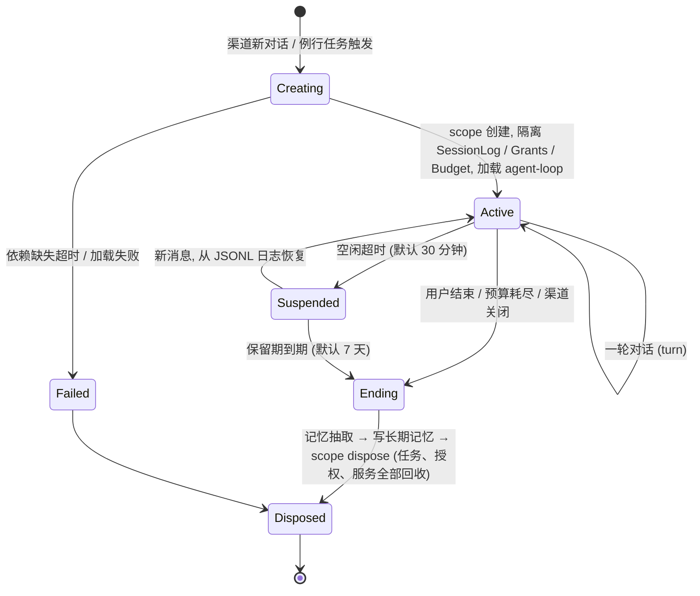

*图：会话作用域生命周期（PNG：[img/session-lifecycle.png](img/session-lifecycle.png)）*

- 挂起（Suspended）= scope 被 dispose，仅保留日志；恢复 = 新 scope + 日志重放（不调用模型）。因此内存中只存在活跃会话。
- 会话内任何插件/任务崩溃只让该会话 fiber 失败，渠道收到错误提示并可 `/retry`；其它会话不受影响。

### 5.8 渠道

| 顺序 | 渠道 | 里程碑 | 要点 |
|---|---|---|---|
| 1 | **CLI** | M2 | 流式输出、思考折叠、内联审批、`/memory` `/tree` `/cost` `/think` 斜杠命令 |
| 2 | **飞书** | M4 | **1.0 唯一的 IM 渠道**。自建应用机器人；使用长连接事件订阅（无需公网回调地址）；审批卡片用交互式消息 |
| 3 | **本地 Web UI**（计划） | M4 | 仅绑定 127.0.0.1（远程访问用户自行反代）；对话、审批卡片、插件树与 trace 查看器、演化提案与账本 |

**决定**：IM 只做飞书；Telegram、企业微信移出 1.0 范围（以后可由第三方渠道插件提供，渠道接口不变）；**个人微信不做**（无官方 API，违反服务条款风险）。CLI 是主界面与开发界面，本地 Web UI 保留为 M4 计划项。

渠道是 stop-first 插件（独占长连接），配置变更时先断后连。

### 5.9 受控自我演化

**提案类型**（风险从低到高）：①Skill（纯文本）②配置补丁（YAML diff：启用已安装插件、调参数）③新插件代码（只能是 T2）。**不可提案**：权限策略、能力上限、内核与 T0 包版本。

<!-- fig: evolution -->
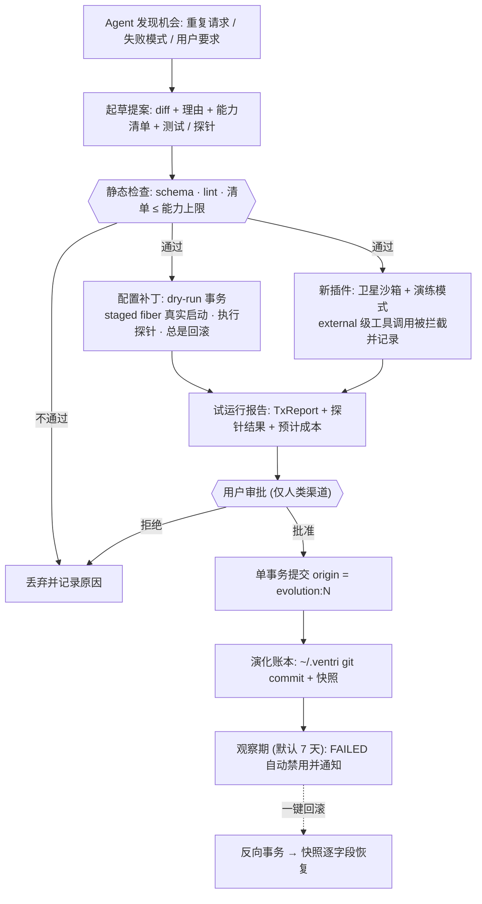

*图：受控自我演化流程（PNG：[img/evolution.png](img/evolution.png)）*

- **演练模式（dry-run 的副作用对策，对应 N1）**：试运行期间，`intercept(ToolCall)` 把 `external` 及以上风险的调用替换为“记录并返回模拟结果”，报告中列出“如果生效，它会做什么”。
- **一键回滚** = 对账本条目做反向配置补丁，作为一个事务应用；对配置补丁类，回滚后 `snapshot()` 与提案前相等（M3 验收测试）。
- **频率限制**：每天最多 3 个待批提案；被拒的同类提案 30 天内不再提出。

---

## 6 对比

| 维度 | **Ventri（目标）** | cordis 4.0.0-rc.10 | @deepseek-ai/cordis 4.0.4 + DeepSeek Harness | Python cordis 移植（cordis-port / cordis-python / cordispy） | Arclet Entari / Letoderea | DI 库（dishka 等） |
|---|---|---|---|---|---|---|
| 语言 | Python 3.12+ | TypeScript | TypeScript | Python | Python | Python |
| 定位 | Agent 运行时内核 + 个人 Agent | “时空可组合性的元框架” | 编码/通用 Agent 产品的私有分叉内核 | 业余移植 | 聊天机器人框架 + 事件系统 | 依赖注入 |
| 并发模型 | anyio 结构化并发；插件树 = 任务树 | Promise + fiber 生命周期 | 同上，修复了 fiber 重入/销毁问题 | 多为 asyncio 裸任务 | asyncio | 无 |
| 插件依赖与自动挂起/恢复 | ✅ inject，缺失 PENDING、恢复自动重载 | ✅ | ✅ | 部分 | 部分 | ❌（解析失败即报错） |
| 事务化变更 + 精确回滚 | ✅ 蓝绿暂存、原子提交、快照级回滚 | ❌ | ❌（profiles 叠加补丁，但非事务） | ❌ | ❌ | ❌ |
| 作用域/隔离 | realm（M1），会话即 scope | ✅ isolate | ✅ 会话即 scope | 少见 | 部分 | 仅 app / request 等固定作用域 |
| 类型化服务访问 | `ctx.get(Type)` + 签名注入 + stub | TS 声明合并 | TS 声明合并 | 弱 | 部分 | ✅（强项） |
| 声明式配置热应用 | YAML → diff → 单事务 | cordis.yml + loader | 一切皆 cordis.yml 中的一行 | 少见 | 配置文件 | ❌ |
| 可观测性 | 稳定 trace schema、JSONL/OTel、Agent 自省 | 有限 | inspect 工具（只读） | ❌ | 日志 | ❌ |
| 模型代码安全边界 | 子进程 + macOS 沙箱 + 能力清单（1.0） | ❌ | 曾允许非隔离 VM 挂载 → 收敛为只读 | ❌ | ❌ | ❌ |
| 受控自我演化 | ✅ 提案 → 试运行 → 审批 → 事务 → 回滚 | ❌ | ❌ | ❌ | ❌ | ❌ |
| API 稳定性 | 0.x 期间按里程碑冻结，1.0 起 semver | rc，不稳定 | 跟随 DeepSeek 产品，与上游分叉 | 不稳定 | 相对稳定 | 稳定 |

**结论**：我们向 cordis 借鉴语义（Context / 服务 / inject / Fiber / effect），向 Harness 借鉴“一切皆配置行、会话即作用域、profile 叠加”的产品形态；真正的差异化是 **结构化并发 + 事务回滚 + 安全边界 + 受控演化** 这一组合，以及 Python 生态位。与 LangGraph、PydanticAI 等 Agent 编排库不竞争：它们解决“一次推理流程怎么编排”，Ventri 解决“一个长期运行的 Agent 进程怎么组装、变更、隔离与观察”，它们可以作为 Ventri 插件运行。

### 6.1 与 DeepSeek Harness 生态的兼容

**决定**：不兼容 Harness 的运行时，复用它的**资产**。

| 资产 | 能否复用 | 方式 | 时间 |
|---|---|---|---|
| **TS 插件**（cordis 插件、`dsh-tool-*` 等） | ❌ 不能直接运行 | 运行时不同（Node + cordis fiber vs Python + anyio），API 与生命周期都不能互通 | — |
| **MCP 服务器** | ✅ **主路径** | Harness 生态里以 MCP 服务器形式提供的工具，经 5.5 的 MCP 桥直接接入（配置一行即可），工具调用照常过权限引擎 | M3 |
| **Skills**（SKILL.md 风格，纯文本） | ✅ 若是纯文本 | 直接放进 `~/.ventri/skills/`，由 Skills 加载器读取；带脚本的 Skill 按其脚本另行评估 | M3 |
| **工具 schema / 提示词 / Agent 预设文本** | ✅ 手工或脚本移植 | JSON Schema 工具定义改写为 strict 兼容格式；persona / 提示词作为 `personas/*.md` | 随时 |
| **TS 插件（桥接）** | ⏳ 可选，1.0 之后 | Node 子进程里运行一个最小 cordis 宿主，把其工具以 JSON-RPC 暴露为一个卫星 fiber（信任级别按来源定为 T1/T2） | 1.0 后 |

**待核实**（M3 前完成，结果写入 ADR）：Harness 中哪些工具是 MCP 服务器、哪些只是进程内 cordis 插件；其 Skill 目录格式与通用 SKILL.md 约定的差异；仓库许可证是否允许复用提示词与 schema；Node 桥接所需的 `@deepseek-ai/cordis` API 面是否稳定。`cordis.yml` 导入器**不做**。

---

## 7 包结构与仓库布局

**决定**：单仓库（monorepo），`uv` workspace，三个发行包，统一版本号直到 1.0。

| PyPI 名 | 导入名 | 内容 | 依赖 | 状态 |
|---|---|---|---|---|
| `ventri` | `ventri` | 内核 | `anyio` | ✅ 已占位（0.0.1，2026-10-08 发布） |
| `ventri-std` | `ventri_std` | 标准插件 + `ventri` CLI | `ventri`；extras：`[otel]` `[watch]` `[sandbox]` | ⏳ 尚未占位（2026-10-08 仍可注册） |
| `ventri-agent` | `ventri_agent` | Agent 运行时、内置插件、渠道、`va` CLI | `ventri-std`, `httpx`, `pydantic>=2`, `mcp`；extras：`[web]` `[feishu]` `[vec]` | ✅ 已占位（0.0.1，2026-10-08 发布） |

```text
ventri/                      # 仓库根（当前原型所在）
├── packages/
│   ├── ventri/              # L0 内核
│   │   └── src/ventri/      #   kernel fiber context transaction scope
│   │                        #   events trace plugin
│   ├── ventri-std/          # L1 标准插件
│   │   └── src/ventri_std/  #   config loader profiles secrets trace_jsonl
│   │                        #   otel http storage scheduler sandbox inspect cli
│   └── ventri-agent/        # L2–L4
│       └── src/ventri_agent/#   providers loop context tools memory mcp skills
│                            #   permission sessions evolution routines channels
├── tests/                   # 只用 asyncio；夜间 DeepSeek 契约测试
├── benchmarks/              # 4.13 的性能目标
├── examples/
├── docs/                    # 本文档、ADR (docs/adr/NNNN-*.md)、用户手册
└── pyproject.toml           # uv workspace
```

用户侧目录：

```text
~/.ventri/                   # git 仓库（演化账本）
├── ventri.yml               # 配置与用户资产（入 git）
├── profiles/ personas/ skills/ plugins/
├── generated/               # T2 插件代码 + 能力清单（入 git）
└── sessions/*.jsonl  memory.db  audit.jsonl  trace/   # 运行数据（不入 git）
```

- **CLI**：`ventri`（来自 ventri-std：`run / apply / tree / doctor / stubgen`）；`va`（来自 ventri-agent：`init / chat / serve / propose / history / rollback / memory`）。
- **插件发现**：entry point 组 `ventri.plugins`；1.0 前不做插件市场，只维护一个索引页。
- **平台**：1.0 只支持 macOS（建议 macOS 14+，Apple Silicon 为主要测试目标，最低版本在 M1 确认）；Linux、Windows 推迟到 1.0 之后。内核是纯 Python，CI 可顺带在 Linux 上跑内核测试作回归信号，但不构成支持承诺。
- **版本与兼容**：Python ≥ 3.12；0.x 期间每个里程碑末冻结一次 API 并写迁移说明；1.0 起 semver，trace schema 与配置 schema 各自带版本号。
- **许可证（决定）**：MIT，仓库根目录 `LICENSE`（Copyright (c) 2026 Jeff / Ventri contributors）。

---

## 8 路线图

**工期假设（已确认）**：Jeff 全职投入（约 1 名全职当量，Agent 辅助）。所有工期均为**估算**，置信度随距离递减；每个里程碑以**退出标准**而非日期为准。

<!-- fig: roadmap -->
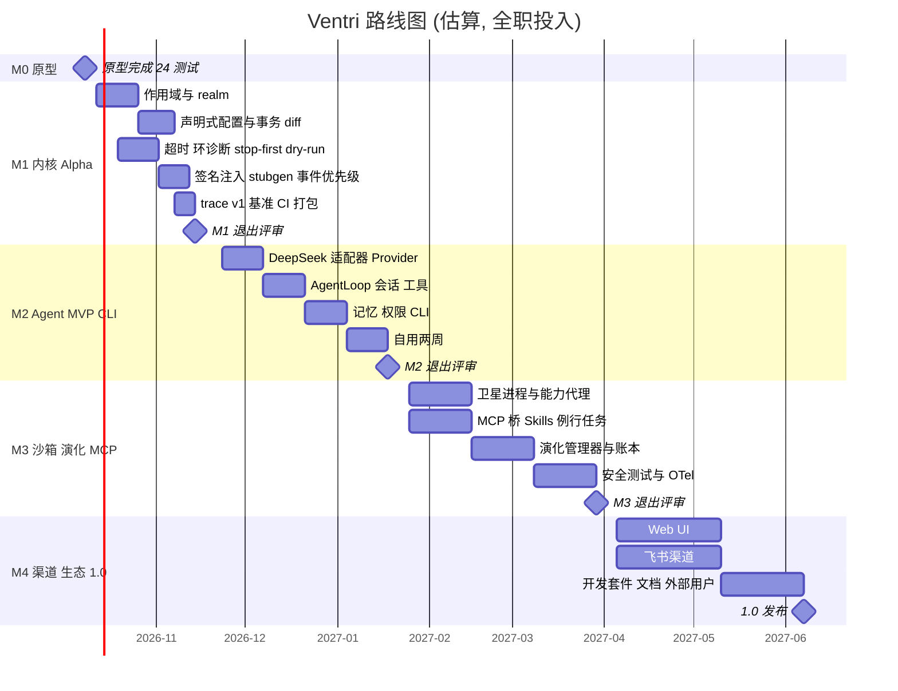

*图：路线图（估算）（PNG：[img/roadmap.png](img/roadmap.png)）*

### M0 — 原型（✅ 已完成，2026-10-08）

- 交付：Kernel/Context/Fiber/事务/观测，约 1000 行有效代码；24 个测试（最初在 asyncio + trio 上各跑一遍共 48 个；按 D11 已改为只跑 asyncio，24 个通过）；混沌测试 40 个种子；demo。
- 结论：结构化并发与事务回滚两项核心创新可行，语义已由测试固定。

### M1 — 内核 Alpha（估算 6–7 周）

交付：

1. scope / realm 与作用域感知的注册表、reconcile、事件过滤、事务锁细化；
2. ventri-std 配置加载器：YAML → profiles 合并 → secrets → 校验 → diff → 单事务；文件监视；`ventri apply --dry-run`；
3. 加载超时、依赖环与缺失提供者诊断、`FAILED` 重试策略；
4. stop-first 替换、dry-run 事务、事务元数据与超时；
5. 签名注入、可选依赖、`Secret[T]`、`ventri stubgen`；事件优先级、类型化事件、拦截器；
6. trace schema v1 + JSONL sink；
7. monorepo + uv workspace、CI（macOS runner 为主；Python 3.12/3.13/3.14，只用 asyncio）、hypothesis 属性测试、benchmarks；补占位 `ventri-std`（`ventri`、`ventri-agent` 已于 2026-10-08 占位）；发布 `ventri 0.2.0a1`。

退出标准：

- [ ] M0 全部测试 + 新增作用域/配置/诊断测试通过（asyncio）；混沌测试 ≥ 1000 种子无泄漏、无死锁；
- [ ] 两个会话 scope 隔离：互不可见、各自回收后 `snapshot()` 回到基线；
- [ ] 修改 YAML 中任一插件配置 → 单事务热应用；注入失败 → 回滚且旧配置继续服务；
- [ ] 4.13 全部性能目标达成（或记录偏差并调整目标的 ADR）；
- [ ] pyright strict 下 `ctx.llm` 有正确类型；
- [ ] 内核 API 冻结为 0.2，写出 API 参考。

#### M1 实施说明（2026-10-08）

实现中对设计做了以下细化或调整（每条附原因）：

1. **trace kind 增补**：内核另发 `kernel.start/stop`、`fiber.retry`；`tx.rollback` 带 `degraded` 属性（stop-first 降级回滚）；`ts` 为 Unix 纪元秒（UTC）。`fiber` 路径的每一段取配置 id（`meta["id"]`），否则取插件名——这样路径在重启间稳定。上层通过 `ctx.trace(kind, ...)` 发自定义 kind（内核 kind 保留）。原因：可观测性需要内核生命周期与重试事件；格式见 `docs/trace-schema.md`。
2. **稳定 id 的“序号”**：同一父节点下第一个 `use: X` 的 id 就是 `X`，之后相同 `use` 的兄弟记为 `X@2`、`X@3`……。原因：在后面追加同类插件时，前面已有插件的 id 不变（不触发无谓的替换）。
3. **拦截器语义**：`Rewrite(new)` 替换值后**继续**执行后续拦截器（而不是像 `serial` 那样在首个非 None 处停止）；拦截器抛错向上传播（fail closed）。由 `await ctx.check(event, value)` 执行。原因：权限引擎、审计、演练模式要能叠加。
4. **realm 不向外回退**：某 scope 隔离了 key K、但 scope 内没有提供者时，K 视为缺失，不回退到外层 realm。原因：否则会话会悄悄用上全局实例，隔离变得不可预测。
5. **会话事务与根 realm 键**：会话 scope 内的事务只持根的共享锁；若它提供的是未隔离（根 realm）的键，与其他并发事务的冲突在提交时以 `TransactionConflict` 检出并回滚，而不是事先阻止。另外，若事务期间它的 scope 或其中的 staged fiber 被外部回收，提交时以 `TransactionError` 回滚（混沌测试发现的缺陷，已修复）。
6. **`ventri apply`**：M1 没有守护进程控制通道，`apply` 只支持 `--dry-run` / `--validate-only`；`ventri run` 在前台托管配置并热应用编辑。`apply/tree/doctor` 在一次性 Kernel 中以 dry-run 事务执行（插件会被实例化再拆除）。
7. **配置加载器插件**（`use: ventri_std.config.loader`）把配置中的插件放在它的**父节点**下，只管理、不拥有：卸载加载器只停止监视。原因：fiber 路径保持 `root/<id>`，与 4.10 一致。
8. **依赖**：`ventri-std` 依赖 `pyyaml`；secrets 默认读 macOS 钥匙串（`security`，服务名 `ventri`），回退到环境变量 `VENTRI_SECRET_<NAME>`。
9. **命名 provides**：插件声明 `provides={"llm": ModelProvider}` 后，`ctx.provide(ModelProvider, v)` 自动获得名字 `llm`，因此 `ventri stubgen` 生成的 `ctx.llm` 类型在运行时同样可用。
10. **不在 M1**：OpenTelemetry 导出与配置目录 git 账本（M3）、开发模式代码重载、`ctx.get` 字符串 key 的 lint 规则；PyPI 发布未执行（需要 Jeff 操作）。

### M2 — Agent MVP（CLI）（估算 7–8 周）

交付：`ventri-agent 0.2`：ModelProvider 接口；DeepSeek 适配器（flash/pro、思考与 effort、reasoning_content 回传校验、strict 工具、JSON 输出、流式、usage/缓存命中/峰谷计价、并发与退避）；OpenAI 兼容适配器；AgentLoop + 预算；ToolRegistry + 内置工具（fs、shell、web.fetch、notes、time、memory、inspect；不含 web 搜索）；会话 scope + JSONL 日志 + 挂起/恢复；短期与长期记忆 v1（SQLite FTS5）；权限引擎 + CLI 审批 + 审计日志；缓存友好 ContextBuilder（epoch、压缩、工件）；`va` CLI。

退出标准：

- [ ] Jeff 连续两周把它作为日常主力 Agent；记录的阻断问题全部关闭；
- [ ] 个人任务评测集（30 个真实任务：笔记整理、资料检索、文件操作、日程类问答等）通过率 ≥ 80%；
- [ ] ≥ 5 轮的会话输入缓存命中率 ≥ 70%（来自 `usage` 实测），并输出每日成本报表；
- [ ] 红队用例（提示注入网页、恶意文件内容诱导写/执行）中，**零**未经批准的 `write-local` 及以上动作；
- [ ] 工具崩溃 / MCP 断开 / 模型 5xx 不导致会话丢失；进程重启后会话可恢复；
- [ ] DeepSeek 契约测试（夜间、真实 API、小额预算）连续 7 天通过。

#### M2 实施说明（2026-10-08）

交付见 `packages/ventri-agent`（`va`）。实现中对设计做了以下细化或调整（每条附原因）：

1. **DeepSeek API 复核（2026-10-08，api-docs.deepseek.com）与 5.2 的差异**：
   - `reasoning_effort` 还接受 `none`（关闭思考），并把 `minimal→low`、`medium/xhigh→high`、`ultra→max` 映射；适配器只接受 `low/high/max/none`。
   - `max_tokens` 未设时默认非思考 8K、思考 64K、`max` 128K；路由可设 `max_tokens`。`frequency/presence_penalty` 已废弃；`top_p` 只在思考模式生效（0.95–1.0）。
   - 新参数 `user_id`（KV 缓存与调度隔离）→ `DeepSeekConfig.user_id`。`finish_reason` 另有 `insufficient_system_resource` / `aborted`：适配器视为**可重试错误**而非答案（否则截断的回答会被当成最终结果）。
   - 函数名只允许 `[A-Za-z0-9_-]`（≤128）：工具在线上以 `fs__read` 形式出现，注册表双向映射；工具名仍以 `fs.read` 为准（权限规则、审计、UI）。
   - strict 模式文档列出的类型不含 `null`，但实测 `anyOf [T, {"type":"null"}]` 被接受（可选参数即用此表达）；文档支持 `$ref/$def`，生成器仍内联（更稳妥）。
   - **实测与文档不符**：思考 + 工具的后续请求省略 `reasoning_content` 时，真实 API 返回 **200** 而非文档所述 400（flash、pro 均如此）。本地校验（`ReasoningContentMissing`）保留：既符合文档，也是缓存前缀逐字节一致的前提。`tool_choice=required` + 思考 → 400，与文档一致。
   - `/models` 返回 `context_window`、`max_output_tokens`、`input_modalities`、`effort.supported_levels`，适配器启动时据此刷新能力描述符并告警未知/旧模型名；`deepseek-chat/reasoner` 在配置期直接报错。V4-Pro 在 2026-09-14 后继续提供（2026-09-10 changelog）。
   - 缓存命中实测以 128 token 为粒度；流式 `usage` 只在最后一个 chunk 上（无单独 usage chunk），`prompt_tokens = hit + miss`。
2. **尾部块追加进历史**：5.3 的 ⑤ 尾部块（时间、工具集变化通知、规划结论、预算提示）以带 `meta.tail` 的 system 消息**追加进历史并写入日志**，而不是每次请求末尾重新生成。原因：DeepSeek 只有完全匹配已持久化前缀单元才命中，任何“只在本次请求出现”的尾部都会让下一次请求不再扩展上一次。时间块最多每 10 分钟一条，并携带当前峰/谷计价状态（评测中发现模型否则会用陈旧知识回答计价问题）。测试断言每次请求都严格扩展上一次请求。
3. **工具集变化**：新工具在下一 epoch 生效（`/epoch`、压缩或新会话），被卸载的工具**立即**不可调用（返回错误结果，提示已在通知中）——即使旧 epoch 的工具列表里还有它。
4. **权限细化**：会话门禁拦截器以最低优先级运行，决定的是其他拦截器改写后的**最终**请求（批准的参数 = 执行的参数）；AgentLoop 失败关闭——没有任何门禁给请求盖章（`approved_by`）就拒绝，包括只读工具。“本会话允许”按**工具名**授予，不覆盖 irreversible/spend 与 `shell.run`。`shell.run` 定为 `external` 且不可授予（命令可做任何事）；`web.fetch` 风险为 read，但默认**询问**（URL 本身可外泄数据），`allow_domains` 放行。M2 没有待审批队列：会话没有绑定渠道（例如无人值守）即拒绝。不可信工具输出用 `<tool-output trust="untrusted">` 围栏，且转义数据中的闭合标签。
5. **会话与热改**：会话状态（日志回放结果）通过隔离的 `Replay` 服务传给会话内插件，而不是插件配置（`tree()` 保持干净）。SessionManager 依赖 ModelProvider/ToolRegistry，替换 provider 会重启管理器并拆除会话 scope；CLI 渠道**惰性查找**服务并从 JSONL 日志恢复会话（与崩溃恢复同一路径），因此热改模型配置不会丢会话。
6. **规划子调用**：`/think max` 让下一条消息先由 `plan` 路由（Pro + max）做一次不带工具的独立子调用，结论作为尾部块注入；`/think low|high|off` 只改主路由的请求参数（不改前缀，不破坏缓存）。
7. **strict 工具默认关闭**（`strict_tools: false`，因其在 Beta 端点）；生成的 schema 始终 strict 兼容，开关只决定是否走 `/beta` 并加 `strict: true`。真实 API 上两种模式都已验证。
8. **记忆抽取时机**：会话结束（`/end`、`/exit`、EOF、7 天保留期扫除）时用 cheap 路由 + JSON 输出抽取一次；敏感项 `pending`，`/memory pending` / `va memory confirm` 确认。
9. **测试与评测**：默认测试全部离线（httpx `MockTransport` + 脚本化假模型；假模型模拟 DeepSeek 前缀单元缓存）；`-m live` 契约测试仅在设置 `DEEPSEEK_API_KEY` 时运行，并加了夜间 CI 工作流（北京时间 01:30 谷时）。30 个个人任务评测在 `evals/agent/`。
10. **不在 M2**：MCP 桥（M3，因此未加 `mcp` 依赖，退出标准中的“MCP 断开”一项随 M3 验收）、图片输入与视觉路由、FIM / 对话前缀续写、Responses 格式、OTel；`va serve/propose/history/rollback` 保留并以退出码 2 提示。PyPI 未发布（需要 Jeff 操作）。
11. **文件工具改用 Hermes Agent 的实现（2026-10-08）**：`fs.*` / `notes.*` 的行为移植自 Hermes Agent（MIT，`tools/_hermes_fs/`，许可见仓库根 `THIRD_PARTY_NOTICES.md`），Ventri 的架构不变——仍是 `tool:fs` 插件（`roots`、`write: ask|allow|deny`）、roots 内路径限定（解析符号链接，越界即拒绝）、风险/subject/默认动作元数据、不可信输出围栏、strict schema。没有移植 Hermes 的审批/敏感路径模型和终端后端。
    - 参数变化：`fs.read` 按**行**分页（`offset` 从 1 开始、`limit` ≤ 2000），输出 `行号|内容`，单次约 30K 字符预算（低于 32K 的 artifact 阈值）并给出 `offset=` 续读；`fs.edit` 改为 `old_string/new_string/replace_all`，另有 `edits=[...]` 对同一文件原子地做多处替换（替代 Hermes 的 V4A 多文件补丁：OpenAI 专用格式，且删除/移动无法映射到逐路径的权限 subject）；`fs.search` 改为 Hermes 参数（`pattern`、`target=content|files`、`file_glob`、`output_mode`、`context`、`limit/offset`、`order`），另加 `ignore_case`、`literal`；`fs.write` 保留 `create|overwrite|append`；`notes.read` 加 `offset/limit`，`notes.search` 加 `limit/offset`。没有新增工具（不加 `notes.edit`：现有审批/评测清单不认识它，`fs.edit` 可编辑 roots 内的笔记）。
    - 编辑：9 级模糊匹配、多处匹配列出行号、已应用检测（不写盘）、统一 diff、CRLF/BOM 保留、非 UTF-8 字节用 surrogateescape 原样保留（修复旧实现 `decode(replace)` 写回损坏）、原子写（同目录临时文件 + fsync + `os.replace`，保留权限位）+ 写后 sha256 校验、JSON/YAML/TOML 语法错误拒写、`.py` 等语法检查只报告新增错误。失败详情中引用的文件内容作为 `ToolError(untrusted=...)` 由循环围栏为不可信数据。
    - 读前写/陈旧检测：`FileState` 是**会话级服务**（`session-core` 提供、列入 `SESSION_KEYS`，scope 释放时清除该会话状态；“最后写入者”表进程级共享，用于发现其他会话的写入）。`overwrite` 仅在本会话持有文件完整当前内容（整读/分页读完/自己写入，且之后未变）时允许，否则拒绝且不动文件；`fs.edit` 只警告（它会重读并以 old_string 定位）。含不可解码字节的读取不算完整读取。会话恢复（重启）后状态为空，需要重新读取。
    - 读取保护：设备/`/proc` 路径、FIFO/套接字等特殊文件、二进制（魔数识别类型）、UTF-16 转码、相似文件名提示、超长行截断、合并冲突标记提示。搜索：ripgrep（`--no-config`、不跟随符号链接）+ 纯 Python 回退（CI 无 rg 时），零结果时给大小写/隐藏文件/正则元字符提示，逗号分隔多路径。
    - 所有文件操作经 `anyio.to_thread` 在线程中执行（读可在超时时放弃，写总会完成），不再阻塞事件循环，`timeout` 与并行只读工具因此生效。
    - 未移植：读取去重/连续读阻断（需要压缩钩子）、密钥脱敏与凭据黑名单（以 roots 限定代替）、文档抽取（PDF/Office，需额外依赖）、LSP 与外部 linter、V4A、Hermes 审批/受保护路径/镜像守卫。

**退出标准当前状态（2026-10-08）**：缓存命中——真实 API 6 轮会话 74.8%（假模型模拟 8 轮 94.8%），`va cost` 每日报表已有；红队——15 个用例（8 种注入载荷 × 拒绝、无渠道、围栏逃逸、授权越级、改写诱导、模型文本冒充批准）零未批准动作（离线、模型“完全服从”的最坏情况）；工具崩溃/模型 5xx/进程重启——测试覆盖，会话不丢且可恢复（MCP 部分随 M3）；个人评测集——30 个任务首次真实运行 29/30（96.7%），修正后复跑失败项通过；契约测试——已全部通过一次，“连续 7 天”需夜间工作流运行（需要仓库 secret）；Jeff 两周自用——未开始。

### M3 — 沙箱 + 自我演化 + MCP（估算 9–10 周）

交付：卫星子进程运行时（同语义微内核 + JSON-RPC）；能力清单与代理；macOS 沙箱后端（sandbox-exec + Seatbelt 配置 + rlimit；T2 无网络）；MCP 桥（stdio + Streamable HTTP）；Skills；调度器与例行任务（谷时延后）；日历工具；演化管理器（提案、静态检查、dry-run/沙箱试运行、演练模式、审批、账本、回滚、观察期）；OTel 导出；可选 Responses 格式适配。

退出标准：

- [ ] 沙箱逃逸测试集（文件系统、网络必须完全不可达、环境变量、进程、资源耗尽、RPC 越权）在 macOS 上全部通过；外部人员做一次安全审阅；
- [ ] 10 个端到端演化场景（3 Skill、4 配置补丁、3 T2 插件）全部走通，回滚后快照与提案前相等；
- [ ] 测试证明：模型输出无法构成批准；提案无法修改权限策略或能力上限；
- [ ] 5 个常用 MCP 服务器（文件系统、GitHub、浏览器类、数据库类、笔记/知识库类）可用，崩溃自动下线/恢复；
- [ ] 每日简报例行任务稳定运行 14 天，且全部在谷时执行。

### M4 — 渠道、生态与 1.0（估算 10–12 周）

交付：飞书渠道（1.0 唯一 IM：长连接事件、交互式审批卡片、群聊与私聊会话映射）；本地 Web UI（计划项：对话、审批卡片、插件树/trace 查看器、演化账本）；插件开发套件（模板、`ventri.testing` 测试夹具、文档）；用户手册与示例；插件索引页；安全审阅修复；semver 与弃用策略；`ventri 1.0` / `ventri-agent 1.0`。

退出标准（1.0）：

- [ ] Jeff 之外 ≥ 20 名周活用户（P1 画像），≥ 5 个第三方插件；
- [ ] 飞书渠道连续 14 天作为 Jeff 的日常入口稳定运行（断线自动重连、审批卡片全流程可用）；
- [ ] 内核、配置 schema、trace schema、插件 API 冻结；
- [ ] 连续 30 天无 P0 缺陷；从 0.x 的升级路径有文档与自动迁移；
- [ ] 1.4 节的完成态体验在 macOS 上全部可演示；安装文档只覆盖 macOS。

### 里程碑之间的决策点（Go / No-Go）

- **M2 结束**：若自用两周中“事务/作用域/可观测”没有带来可感知的价值（例如热改配置、会话隔离、诊断问题），则冻结内核新特性，资源全部转向 Agent 体验。
- **M3 中期**：若 macOS 沙箱后端无法达到逃逸测试要求，T2（模型生成代码）推迟到 1.0 之后，不降级运行；1.0 的自我演化只包含 Skill 与配置补丁。
- **M4 开始**：若外部用户 < 5，推迟生态工作，优先补齐用户反馈的 Agent 能力。

---

## 9 风险与对策

| # | 风险 | 可能性 / 影响 | 对策 |
|---|---|---|---|
| R1 | **Python 进程内热重载天然泄漏**（类身份、模块全局、C 扩展、残留引用） | 高 / 中 | 分级策略（4.12）：配置变化走事务（主路径），T2 代码走进程重启，进程内代码重载仅开发模式并告警；对外不宣称“无缝热重载” |
| R2 | **插件/DI 赛道拥挤**，单卖内核难以获客 | 高 / 高 | 内核不单独推广；以 Agent 为入口，用 Agent 功能（热改配置、会话隔离、可回滚演化）证明内核价值；M2 决策点 |
| R3 | **缺少真实用户** | 高 / 高 | M2 起公开发布与自用；中文社区（DeepSeek 用户群、飞书生态）优先；每个里程碑以用户可见能力收尾；1.0 退出标准含外部用户数 |
| R4 | **DeepSeek API 快速变化**（2026 年内两次模型名下线、定价改为峰谷、新增 Responses/Anthropic 格式） | 高 / 中 | 模型名只出现在路由配置；能力描述符 + 启动探测；价格表为数据；夜间契约测试；Provider 抽象保证可切换 |
| R5 | **沙箱实现难、易被高估** | 中 / 高 | 只依赖 OS 级隔离；默认拒绝；不支持的平台不运行 T2；逃逸测试集 + 外部审阅；文档明确威胁模型（不防内核 0day） |
| R6 | **自我演化产出低质或危险变更** | 中 / 高 | 人工审批硬门槛；dry-run + 演练模式；能力上限不可被提案修改；频率限制；观察期自动禁用；一键回滚 |
| R7 | **提示注入**（网页、文件、MCP 结果中夹带指令） | 高 / 高 | 工具结果标注来源并置于尾部数据块；有后果动作一律经权限引擎；红队用例纳入 M2 退出标准 |
| R8 | **成本失控**（长上下文、思考 max、循环调用） | 中 / 中 | 每会话/每日预算；缓存友好布局；谷时调度；`/cost` 可见；超预算即停 |
| R9 | **隐私与数据出境**（对话与记忆发送到第三方 API） | 中 / 中 | 已决定接受：所有数据可发送到 DeepSeek API；`va init` 明示这一点；本地模型路由是以后的可选项，不在路线图中 |
| R10 | **范围蔓延**（个人 Agent 功能无穷） | 高 / 中 | 本文第 1.2 / 8 节为准；新增需求先写 ADR 并指定里程碑；M2 工具清单封顶 |
| R11 | **单人维护（巴士因子 = 1）** | 高 / 中 | 测试与 ADR 固化语义；文档优先；模块边界清晰便于贡献者介入 |
| R12 | **依赖 anyio 但只跑 asyncio**：可能被误认为支持 trio，或 anyio 行为与 asyncio 原生语义有细微差别 | 低 / 低 | 文档写明只支持 asyncio；anyio 不出现在公开 API；测试只跑 asyncio；如有必要再评估改为纯 asyncio |
| R13 | **macOS 唯一平台**：`sandbox-exec` 已被 Apple 标记弃用、未来版本可能变化；排除 Linux 服务器用户 | 中 / 中 | 沙箱藏在 `SandboxBackend` 接口后；每个 macOS 大版本跑逃逸测试；Linux 后端在 1.0 后按需求排期；内核纯 Python，不绑定平台 |

---

## 10 决策记录

### 10.1 已决（2026-10-08，Jeff）

| # | 问题 | 决定 | 影响章节 |
|---|---|---|---|
| D1 | 许可证 | **MIT**；仓库根目录 `LICENSE`，Copyright (c) 2026 Jeff / Ventri contributors | 7 |
| D2 | 投入 | **全职**；保留按全职估算的路线图 | 8 |
| D3 | 数据策略 | 所有数据**可以**发送到 DeepSeek API；M2 不要求“敏感会话走本地模型”，以后可作为可选能力 | 5.3、R9 |
| D4 | T2 插件网络权限 | **推迟**：1.0 范围内 T2 无网络，`net` 字段保留；以后再决定 | 4.11 |
| D5 | 1.0 平台 | **只支持 macOS**（沙箱用 `sandbox-exec` / macOS 机制）；Linux、Windows 推迟到 1.0 之后 | 1.2、3.1、4.11、7、8、R13 |
| D6 | 与 Harness 的关系 | 不兼容运行时、不做 `cordis.yml` 导入；通过 MCP（主路径）、纯文本 Skills、schema/提示词复用资产；Node 桥接 1.0 后可选 | 6.1 |
| D7 | 名称 | Agent 正式名 **Ventri Agent**，CLI 命令 **`va`** | 1.4、7 |
| D8 | 组织 | **不创建 GitHub 组织** | 7 |
| D9 | IM 渠道 | **只做飞书**；Telegram、企业微信移出 1.0；CLI 保留为主界面，本地 Web UI 为 M4 计划项 | 3、5.8、8 |
| D10 | web 搜索 | **推迟**，移出 1.0 范围（无内置 `web.search`） | 5.4、8、10.3 |
| D11 | 异步后端 | **只支持 asyncio**；放弃 trio。内核保留 `anyio` 作内部依赖、固定 asyncio 后端；原型测试已改为只跑 asyncio | 4.4、7、8、R12 |
| — | PyPI 占位 | `ventri`、`ventri-agent` 已发布 0.0.1 占位（2026-10-08）；`ventri-std` 尚未占位，列为 M1 任务 | 7 |

### 10.2 仍待决

无。截至 2026-10-08，第 10 节此前列出的问题已全部拍板（D1–D11）。

### 10.3 推迟的决策（1.0 之后再议）

- T2 插件是否、以及如何获得网络访问（D4）。
- Linux / Windows 支持与对应的沙箱后端（D5）。
- 敏感会话的本地模型路由（D3）。
- Harness TS 插件的 Node 子进程桥接（D6）。
- web 搜索：是否内置、默认提供商（自建 SearXNG 或商业 API）（D10）。
- Telegram、企业微信等其他 IM 渠道（D9）。

---

## 附录 A 术语

| 术语 | 含义 |
|---|---|
| Fiber | 一个插件实例的生命周期载体（状态机 + task group + effect 栈） |
| Effect | 注册即执行、卸载时逆序清理的副作用 |
| Realm | 一组被隔离的服务键所在的命名空间，由 scope 创建 |
| Staged / overlay | 事务中暂存的 fiber 及其私有服务视图 |
| Epoch | 会话中工具集与稳定前缀保持冻结的区间 |
| T0 / T1 / T2 | 插件信任分级：可信 / 本地 / 不可信（沙箱） |
| 卫星进程 | 运行 T2 插件的沙箱子进程 |
| 演化账本 | `~/.ventri` git 历史 + 每次提交的快照与提案记录 |

## 附录 B 参考资料

- Ventri 原型：本仓库 `README.md` 与 `ventri/` 源码（M0）。
- cordis：<https://github.com/cordiverse/cordis>（npm `cordis` latest = 4.0.0-rc.10，2026-10-08 核查）。
- DeepSeek Harness：<https://github.com/deepseek-ai/deepseek-harness>；内置分叉 `@deepseek-ai/cordis`（npm latest = 4.0.4，2026-10-08 核查）。

[^ds-pricing]: DeepSeek API Docs, *Models & Pricing*, <https://api-docs.deepseek.com/quick_start/pricing>（2026-10-08 访问）。
[^ds-changelog]: DeepSeek API Docs, *Change Log*（2026-04-24 V4、2026-07-31 V4-Flash、2026-08-13 V4-Pro GA 与峰谷定价、2026-09-10 V4.1-Flash），<https://api-docs.deepseek.com/updates>（2026-10-08 访问）。
[^ds-thinking]: DeepSeek API Docs, *Thinking Mode*, <https://api-docs.deepseek.com/guides/thinking_mode>（2026-10-08 访问）。
[^ds-tools]: DeepSeek API Docs, *Tool Calls*（strict 模式、中途插入工具调用的格式差异），<https://api-docs.deepseek.com/guides/tool_calls>（2026-10-08 访问）。
[^ds-cache]: DeepSeek API Docs, *Context Caching*, <https://api-docs.deepseek.com/guides/kv_cache>（2026-10-08 访问）。
